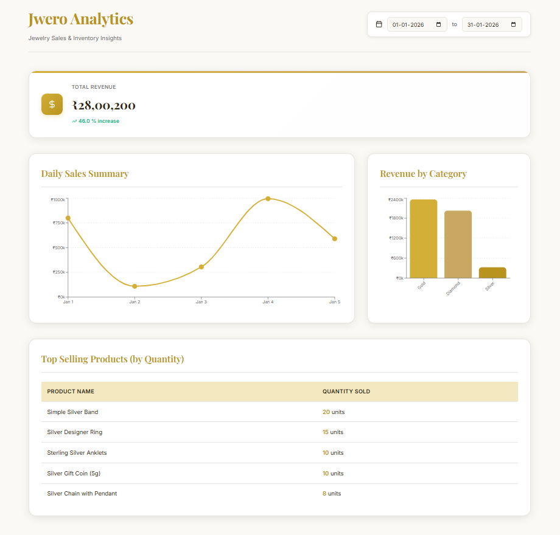

# 📄 Jwero Analytics Dashboard

A full-stack business intelligence platform for jewelry retailers, providing real-time insights into revenue, daily sales trends, and product performance.

---

## 🛠 Tech Stack

* **Frontend:** React.js, Vite, Recharts (for data visualization), Lucide-React (icons).
* **Backend:** Node.js, Express.js.
* **Database:** MySQL.


---

## 📂 Project Structure

```text
jwero-analytics/
├── backend/            # Express API logic & SQL controllers
├── frontend/           # React application & Dashboard UI
├── database/           # SQL scripts for setup
│   ├── schema.sql      # Database table structures and dummy data
└── README.md           # Documentation 

```

---

## ⚙️ Setup & Installation

### 1. Database Setup
 
 In MYSQL WORKBENCH--

1. Create a MySQL database named `jwero_db`.
2. Run the scripts located in the `/database` folder :
*  Execute `schema.sql` to create the tables and schema.


### 2. Backend Configuration

1. Navigate to the backend folder: `cd backend`.
2. Install dependencies: `npm install`.
3. Create a `.env` file and add your credentials:
```env
DB_HOST=localhost
DB_USER=root
DB_PASSWORD=your_password
DB_NAME=jwero_db


```


4. Start the server: `npm start`.

### 3. Frontend Configuration

1. Navigate to the frontend folder: `cd frontend`.
2. Install dependencies: `npm install`.
3. Start the development server: `npm run dev`.

---

## 📡 API Reference

All APIs support dynamic date filtering via query parameters.

### **Get Revenue Overview**

`GET-- http://localhost:5000/api/analytics/revenue?startDate=YYYY-MM-DD&endDate=YYYY-MM-DD`

* **Description:** Returns total revenue for the period and compares it to the previous month.

### **Get Daily Sales Trend**

`GET-- http:localhost:5000/api/analytics/daily-sales?startDate=YYYY-MM-DD&endDate=YYYY-MM-DD`

* **Description:** Returns a list of revenue grouped by day for line chart visualization.

### **Get Top Selling Products**

`GET-- http://localhost:5000/api/analytics/top-products`

* **Description:** Returns the most popular jewelry items by quantity sold.

###  **Get Revenue by Category**

`GET-- http://localhost:5000/api/analytics/category-revenue`

* **Description:** Retrieves a breakdown of total revenue for each jewelry category.
## 📈 Features

* **Dynamic Filtering:** Updates all charts instantly based on the selected date range.
* **Growth Indicators:** Visualizes revenue growth vs. the previous month.


---

## 🤝 Contact

**Ujwal Tiwari** [ujwaltiwari034@gmail.com] | [https://www.linkedin.com/in/ujwal-tiwari-69b410331/]

---

### How to use this file:

1. Create a new file in your main project folder called `README.md`.
2. Copy the text above and paste it inside.
3. Replace the bracketed text (like `[Your Name]`) with your actual information.

